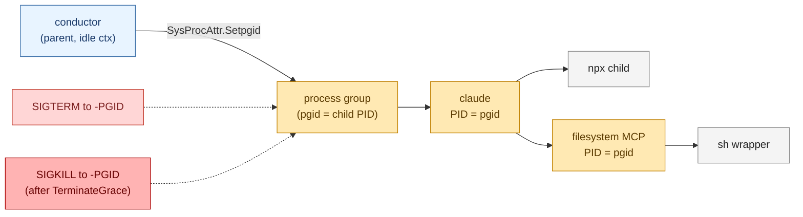

# Process model — subprocess, cancellation, Windows refusal

> **Source of truth:** `server/internal/backend/proc_other.go`,
> `server/internal/backend/proc_windows.go`,
> `server/internal/backend/stderr_tail.go`,
> `server/cmd/conductor/main.go`.

## Subprocess lifecycle

Every backend ultimately spawns **one** subprocess — the LLM CLI — and
reads from it via three pipes (stdout, stderr, stdin). On Unix systems the
subprocess is launched with `SysProcAttr.Setpgid = true` so its process
group can be killed as a unit.

### Spawn sequence

```
1. backend.Execute(ctx, prompt, opts) is called by the CLI.
2. lookPath(opts.ExecutablePath) — fail fast with a clear message if the
   binary is not on $PATH.
3. preflight: write the brief to <cwd>/CLAUDE.md or <cwd>/AGENTS.md,
   ensure $CODEX_HOME/config.toml when MCP is configured.
4. exec.CommandContext(ctx, execPath, argv...) with:
   - Dir = opts.Cwd ("" → caller's cwd)
   - Env = append(os.Environ(), flattened opts.Env...)
   - Stdin = a pipe (claude only — codex takes the prompt positionally)
   - Stdout/Stderr = os.Pipe (stderr goes via stderr_tail.go)
   - SysProcAttr.Setpgid = true on Unix, nothing on Windows.
5. cmd.Start() — non-blocking. Spawn failure aborts Execute and
   closes both channels.
6. Two goroutines run:
   - scanner: line-delimited JSON from stdout → wire handlers →
     Messages.
   - stderr_tail: copy stderr → rolling 4 KiB buffer (used for
     post-mortem only).
7. cmd.Wait() blocks on procDone. close(procDone).
8. finalizeStreamResult classifies the outcome, builds the single
   Result, sends it on Result, and closes both channels.
```

### What `cmd.Wait()` returns

The backend captures the subprocess' exit error but **does not** treat it
as terminal on its own. `finalizeStreamResult` uses the wire-level
`result` / `turn.completed` event plus `runCtx.Err()` to decide. Exit
codes are surfaced in `MessageError` log lines and the terminal
`Result.Error` if the model frames the run as failed.

## Cancellation

There are three classes of cancellation, layered:

### 1. CLI-level (user presses Ctrl-C)

```go
ctx, stop := signal.NotifyContext(context.Background(),
    syscall.SIGINT, syscall.SIGTERM)
defer stop()
```

`SIGINT` / `SIGTERM` cancels the parent `ctx`. The backend forwards
that cancellation through `exec.CommandContext` and to its internal
goroutines.

### 2. Wall-clock (`opts.Timeout`)

`runContext(ctx, timeout)` returns a derived context with
`context.WithTimeout(ctx, timeout)`. On expiry:

- `runCtx.Err() == context.DeadlineExceeded`
- `finalizeStreamResult` reclassifies a `completed` model run as
  `"timeout"` (the model may have finished talking but the wall clock
  was breached, and the CLI may have been SIGTERMed mid-shutdown).
- If the spawned subprocess is still running, the backend's
  process-group machinery delivers a graceful shutdown.

### 3. Semantic inactivity (`opts.SemanticInactivityTimeout`)

A separate watchdog goroutine ticks every second and fires if no event
has arrived on stdout for the configured duration. Catches
"model is silently thinking and never returns" without giving up on long
reasoning passes. Surface: `Result.Status = "timeout"`.

## Graceful whole-tree kill (Unix)

The point of `Setpgid = true` is that **everything** the CLI spawns
(npm downloads, MCP servers like the filesystem MCP, child shells) ends
up in the same process group as the CLI itself. On cancellation:

1. backend closes stdin (signals EOF for stream-json input framing).
2. Backend sends `SIGTERM` to `-PGID`. The CLI and *all* its descendants
   receive it; well-behaved ones exit, MCP servers get the same signal.
3. `terminateGrace` (`codexTerminateGrace = 5s`,
   `claudeTerminateGrace = 5s`) elapses.
4. Backend sends `SIGKILL` to `-PGID`. No process in the tree can
   survive.

This is the entire reason subprocess cancellation in conductor is
correct: a vanilla `cmd.Process.Kill()` would only send `SIGKILL` to
the CLI, leaving the MCP servers orphaned and the npm download
running.

The implementation split is:

- `proc_other.go` — Unix / Linux / macOS: `Setpgid = true` plus
  `kill(-pgid, sig)`.
- `proc_windows.go` — Windows: refuses with an explicit error at
  execute-time.

## Why Windows is not supported

The subprocess machinery relies on Unix process groups (`Setpgid` +
`kill(-PGID, sig)`) for graceful whole-tree cancellation. There is no
portable Windows equivalent — Job Objects offer some of the same
properties but the API surface, signal story, and `syscall` reach into
the stdlib are different enough that V1 explicitly defers it.

`proc_windows.go` returns a clear error rather than silently doing the
wrong thing:

> "Windows is not supported by conductor's process-group machinery;
> macOS and Linux only."

The binary still compiles on Windows (`go build ./cmd/conductor`
succeeds), but refuses to spawn agents at runtime. Adding real Windows
support is V2 work.


## Process tree and cancellation

`Setpgid = true` puts the spawned CLI and **every** subprocess it
launches (npm downloads, MCP servers like the filesystem MCP, child
shells) into one process group, so a single `kill(-pgid, sig)` is
enough to reach the whole tree:



The leaf nodes (npm, shell) only exist while the parent CLI is
running — they're spawned on demand and exit when the parent's
turn completes. Killing the group means no orphan npm download or
MCP server ever survives a Ctrl-C.

## Build matrix

| OS      | Architectures        | Status                       |
|---------|----------------------|------------------------------|
| macOS   | `darwin/amd64`, `darwin/arm64` | Supported                    |
| Linux   | `linux/amd64`, `linux/arm64`   | Supported                    |
| Windows | `windows/*`          | Builds, refuses at run-time  |

The .github build, if added, would list `darwin/amd64`,
`darwin/arm64`, `linux/amd64`, `linux/arm64` and skip `windows/*`.

## stderr tail

`stderr_tail.go` is a small wrapper around `io.Pipe` that copies the
subprocess' stderr into a bounded ring buffer (default ~4 KiB). On a
non-completed run, the trailing lines are surfaced in `Result.Error` so
the user can see what the CLI printed before dying — model output stays
on stdout as JSON.
